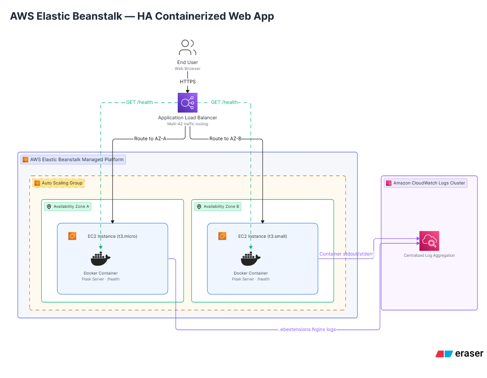
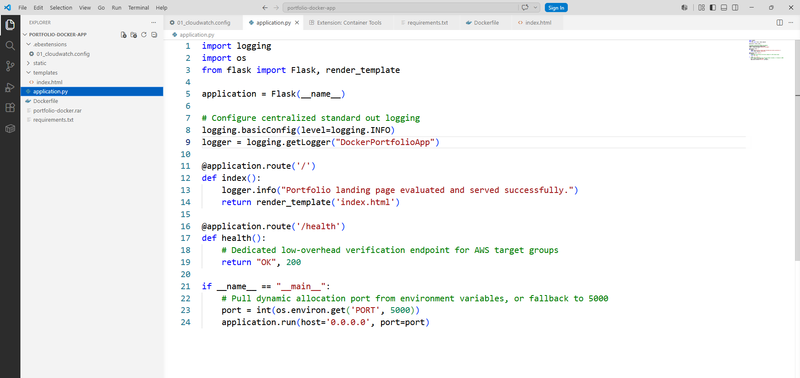
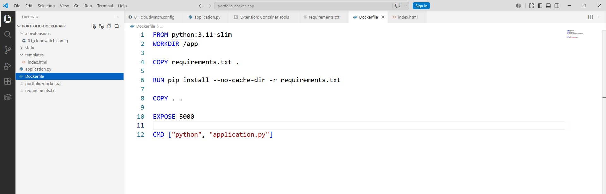
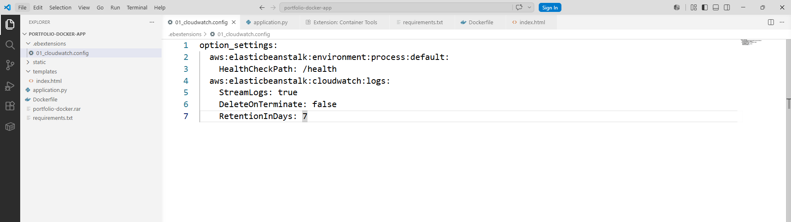
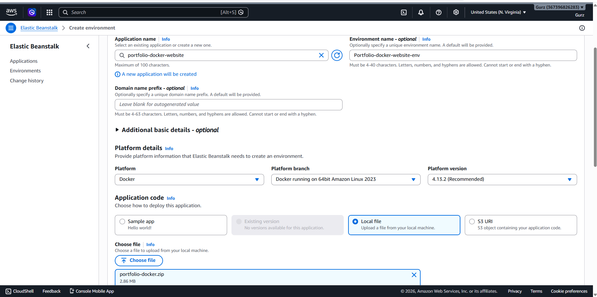
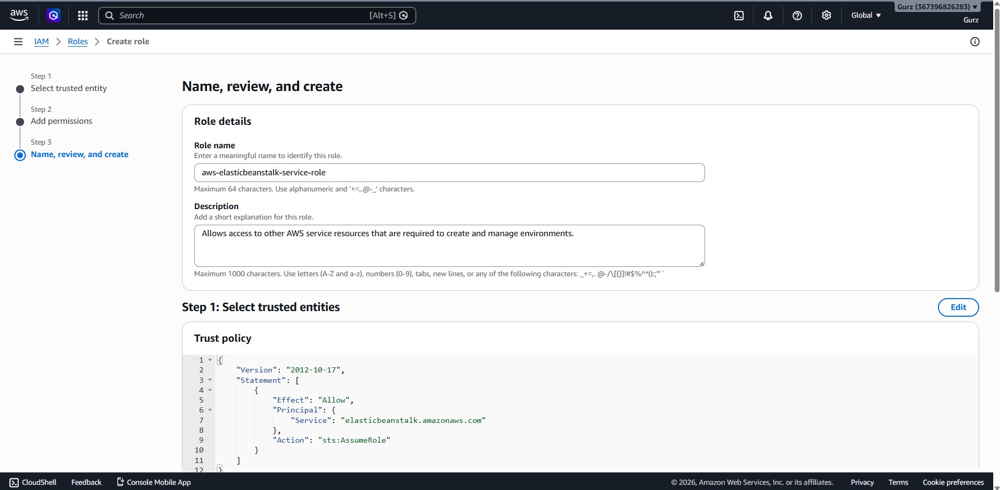
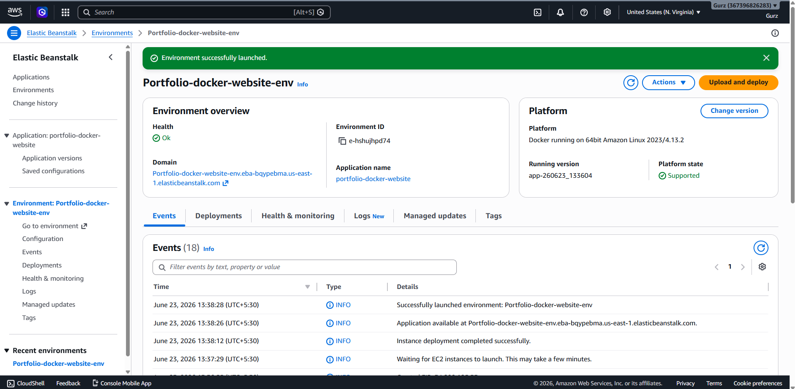
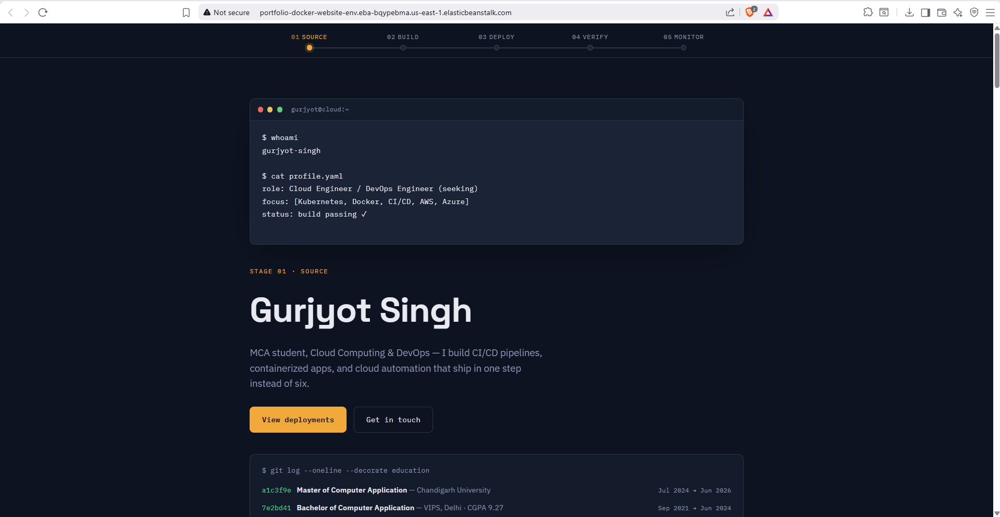
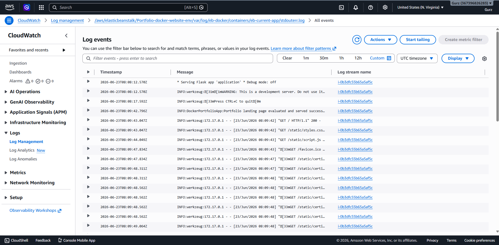

# Containerized Multi-Zone Web Architecture Platform on AWS

A highly available, fault-tolerant, and dynamically monitored web application infrastructure built on AWS using Docker, Elastic Beanstalk, and Amazon CloudWatch. This project transitions a structural frontend portfolio into a dynamic Python Flask application, wrapped in an immutable container layer, and orchestrated across a load-balanced multi-availability-zone cloud network.

## 🏗️ System Topology & Architecture Walkthrough

* **Architecture Analysis:** Incoming user traffic over HTTPS is intercepted by an AWS Application Load Balancer (ALB), which serves as the public ingress layer. The ALB performs cross-zone load balancing, actively routing traffic across isolated public subnets. Compute instances are managed inside a dynamic Auto Scaling Group (ASG) running automated instance sizes (`t3.micro` and `t3.small`) across separate Availability Zones. Concurrently, an integrated Amazon CloudWatch logging plane acts as a centralized telemetry collector, pulling decoupled container and platform runtime metrics out of the execution boundaries.

---

## 🛠️ Application Containerization & Configuration

### 1. Main Server Engine Implementation (`application.py`)

* **Code Implementation Walkthrough:** The backend framework leverages a Python Flask runtime environment explicitly configured for WSGI standards by binding the core module callable object to `application`. It sets up high-performance routing handlers along with a dedicated `/health` resource path used as a system state probing endpoint by the Application Load Balancer target groups.

### 2. Immutable Containerization Pattern (`Dockerfile`)

* **Container Layer Breakdown:** The system blueprint uses an optimized `python:3.11-slim` official base layer to minimize security attack surfaces. It isolates code directories inside `/app`, installs pinned requirements with cache-busting optimization, exposes execution proxy ports, and runs the application using an absolute execution vector command.

### 3. Decoupled Observability Configuration (`.ebextensions/01_cloudwatch.config`)

* **Infrastructure as Code Mechanics:** The Elastic Beanstalk configuration file embeds system-level definitions directly into the host deployment workflow. It defines the root health path mapping rules for the load balancer target groups and dynamically activates automated real-time CloudWatch platform log streaming alongside an automated cost-optimized 7-day retention sweep.

---

## 🚀 Infrastructure Provisioning & Deployment Steps

### 1. Application Upload & Platform Specification

* **Deployment Workflow:** The source workspace bundle is zipped directly at the root level and uploaded to the AWS Elastic Beanstalk wizard. The orchestration target platform is explicitly specified as the official managed **Docker** platform branch running on 64-bit Amazon Linux 2023, enabling automated container builds on the cloud host.

### 2. IAM Service Role & Trust Policy Assignment

* **Identity and Access Security:** To uphold the principle of least privilege, separate security permissions are established. An AWS Service Role is granted to Elastic Beanstalk for managing multi-zone infrastructure components, while a dedicated EC2 Instance Profile containing the `CloudWatchAgentServerPolicy` is assigned to compute nodes to grant secure outbound log shipping clearance.

### 3. Live High-Availability Environment Launch

* **Infrastructure Verification:** Following automated provisioning, the Elastic Beanstalk dashboard flags a healthy, operational green status block. This dashboard indicates successful multi-zone auto-scaling assembly, load balancer registration, and live domain endpoint generation.

### 4. Live Frontend Platform Verification

* **Frontend Platform Analysis:** Accessing the live Elastic Beanstalk domain endpoint confirms the successful execution of the end-to-end containerized pipeline. The Python Flask engine dynamically processes requests and renders the Jinja2 templates, compiling asset paths natively from the `/static` container context. The automated typewriter execution terminal and CSS micro-animations load with 100% environment parity, validating that the underlying Nginx reverse proxy is successfully routing external internet traffic on port 80/443 down to the inner Docker application layers.
---

## 🔍 Validation, Observability & Telemetry InspectionLive Log Inspection in Amazon CloudWatch

* **Telemetry Verification Analysis:** Navigating into the active CloudWatch Log Group shows the successfully aggregated platform data plane streams. Selecting the specific container stream container path (`/var/log/eb-docker/containers/eb-current-app/stdouterr.log`) exposes real-time container outputs, successfully registering Flask initialization logs and live incoming HTTP `GET` asset requests with explicit `200 OK` network codes.

## 💻 Technical Toolchain Summary
* **Hosting Platform:** AWS Elastic Beanstalk (PaaS Platform Orchestration)
* **Compute Tier:** Amazon EC2 Cluster (Multi-AZ Linux Nodes)
* **Traffic Management:** AWS Application Load Balancer (ALB)
* **Container Infrastructure:** Docker Runtime Core (Immutable Python Baselines)
* **Observability Plane:** Amazon CloudWatch (Log Groups & Streaming Telemetry Agents)
* **Backend Application:** Python Flask Runtime (Dynamic Routing Engines)
